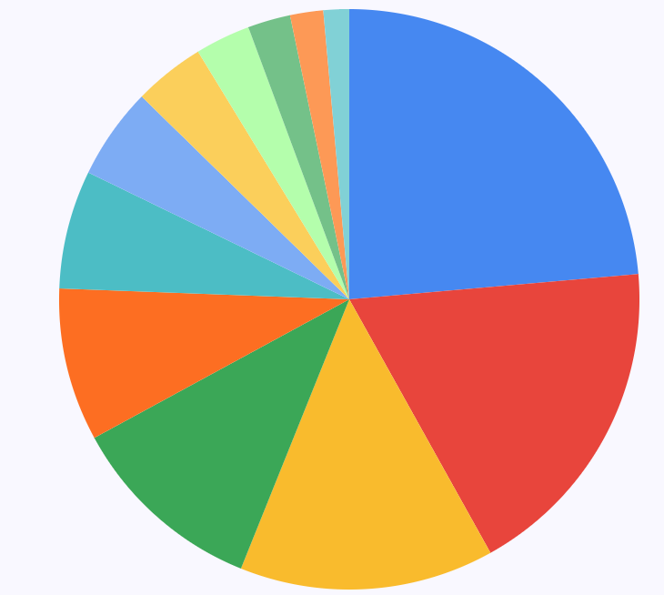

# Ingot NFT

## Introduction

INGOT NFT is a Non-Fungible token in Ingot Farming ecosystem. Each NFT represents something of a unique and rare and is characterized by own "power". NFTs play an important role in Ingot Farming economy, in fact this power is used in combination to the others owned in Pool Farming and determine the amount of percentage of tokens to issue compared at the total power of the Pool.

INGOT NFTs are limited in numbers by definition, they can be acquired in the Store by trading INGOT Tokens. To increase scarcity at a specific time all NFTs unsold will be burned, at this point the only way to acquire a NFT is by users trading.

INGOT NFT uses the latest standard ERC-1155 Multi Token, allows for each token ID to represent a new configurable token type, which may have its own supply and "power" attributes.

## NFT Allocation

At the deploy of contract the following in table will be the attributes of each NFT.

At a specific stage all NFTs unsold will be burned.

| Name | ID | Max Mintable | Power |
| :--- | :--- | :--- | :--- |
| Lead | 0 | 7000 | 10 |
| Aluminium | 1 | 5425 | 14 |
| Zinc | 2 | 4204 | 19 |
| Copper | 3 | 3258 | 26 |
| Tin | 4 | 2525 | 35 |
| Cobalt | 5 | 1957 | 47 |
| Silver | 6 | 1516 | 65 |
| Platinum | 7 | 1175 | 87 |
| Gold | 8 | 910 | 118 |
| Palladium | 9 | 706 | 160 |
| Iridium | 10 | 547 | 215 |
| Rhodium | 11 | 424 | 290 |

## Token Specification

* **Name:** INGOT NFT
* **Symbol:** INGOT
* **Network:** Ethereum 
* **Spec:** ERC1155
* **Smart Contract Address**
* * **ETH: waiting for launch**

