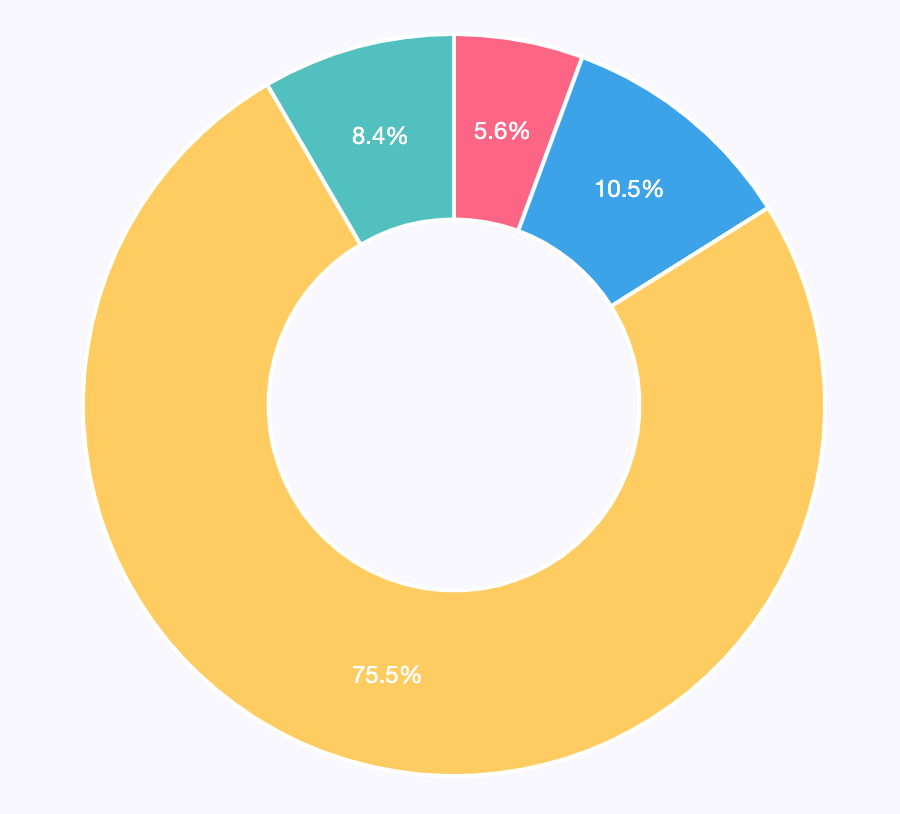

# Ingot Token

## Introduction

Ingot Token is the main fungible token in Ingot Farming ecosystem. It is emitted in a **deflationary** way by the staking of NFTs in Pool Farming.  
Furthermore **to increase deflation,** each time a user buys an Ingot NFT in the store, all tokens spent are immediately burned.

Holders can use the token to buy new NFTs in the store, until reach the mintable limit, voting for governance and trading for other tokens in DeFi system.

## Token Emission

**on BSC\***  
Afterwards, emissions happen when the Project launches, starting at 10 Ingot tokens per block and halves every 4 weeks until it stabilizes after 24 weeks at 0.15625 INGOT per block:

**on ETH\***  
Afterwards, emissions happen when the Project launches, starting at 40 Ingot tokens per block and halves every 4 weeks until it stabilizes after 24 weeks at 0.625 INGOT per block:

* 90% to community via yield farming
* 10% to developers

Token spent in the store are immediately burned

**\*thresholds are calculated by current Average Block Time  
ETH: 14 sec  
BSC: 3 sec**

## Token Allocation

### Circulating supply at launch 3.000.000 INGOT:

* Token Pre-Sale -1.950.000 INGOT
* Initial LP Pancake - 1.050.000 INGOT and 600 BNB \(or 0,057%\)

### Circulating supply after 1 year 15.660.000 INGOT:

* Token Pre Sale - 1.950.000 \(10,5%\)
* Initial LP on Pancake - 1.050.000 \(5,6%\)
* Community Farming - 14.094.000 \(75,5%\)
* Team - 1.566.000 \(8,4%\)

## Token Specification

* **Name:** Ingot Token
* **Symbol:** INGOT
* **Network:** BSC 
* **Spec:** BEP-20
* **Precision:** 18
* **Smart Contract Address:** 0x45795Fa0d1685B77C0554Cdd7451012a2095C22E

\*\*\*\*

